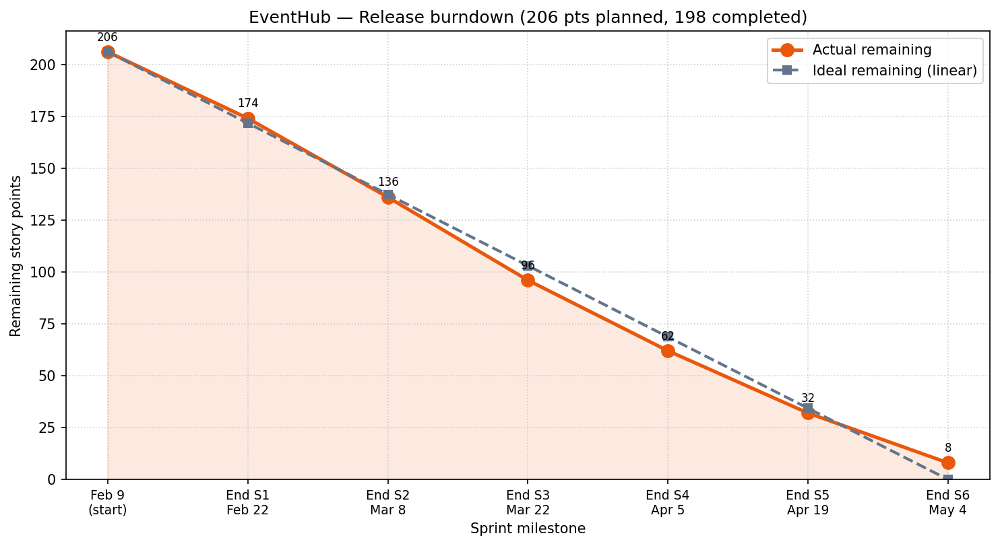

# Burndown Charts — EventHub

Release-level burndown and sprint velocity for Sprints 1–6 (Feb 9 – May 4).

---

## Release burndown (all sprints)

Interactive version (same data): [release-burndown.html](./release-burndown.html)

To regenerate the PNG after editing numbers: `python3 docs/burndown/generate_release_burndown_png.py`

---

## Sprint Velocity Summary

| Sprint   | Planned Points | Completed Points | Velocity | Carry-over |
| -------- | -------------- | ---------------- | -------- | ---------- |
| Sprint 1 | 34             | 32               | 32       | 2          |
| Sprint 2 | 40             | 38               | 38       | 2          |
| Sprint 3 | 42             | 40               | 40       | 2          |
| Sprint 4 | 36             | 34               | 34       | 2          |
| Sprint 5 | 30             | 30               | 30       | 0          |
| Sprint 6 | 24             | 24               | 24       | 0          |

**Totals:** 206 planned · 198 completed · **Average velocity:** ~33 points/sprint

---

## How to Read the Release Chart

1. **X-axis:** Sprint milestones from release start through end of Sprint 6.
2. **Y-axis:** Remaining story points for the whole release (206 pts scope).
3. **Ideal line:** Straight burn from full scope to zero if work closed perfectly evenly.
4. **Actual line:** Cumulative completion after each sprint; ends at 8 pts remaining (carry-over in Sprints 1–4).

**Healthy indicators:**
- Actual stays near or below the ideal line (ahead or on pace).
- Smooth downward slope rather than long plateaus.

**Team notes:**
- Sprint 3 plateau → scope re-prioritization in Sprint 4.
- Sprint 5 matched planned velocity → testing estimates landed well.
